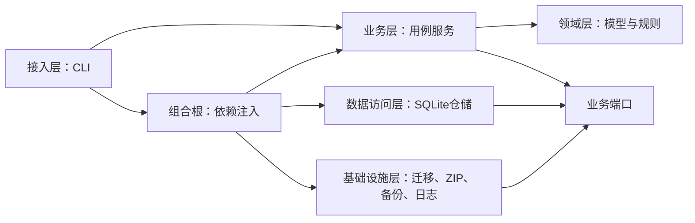
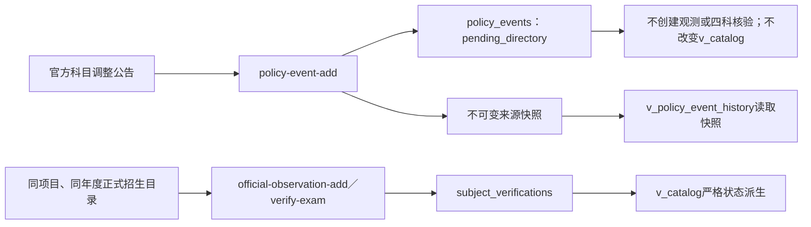
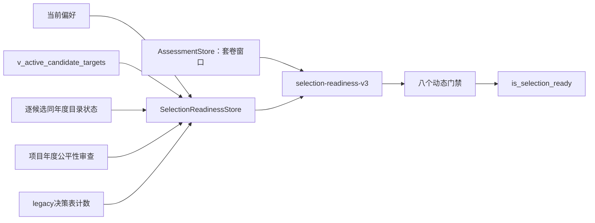

# 架构设计

## 候选画像适配与三年历史覆盖（迁移 028）

迁移 028 在迁移 027 的候选版本链外再追加一层“本人已知偏好适配”审查。`CandidateModelService` 只依赖 `CandidateModelStore`：服务冻结当前画像的全部偏好事件、现状事件、十个逐维结论和条件缺口，SQLite 仓储在同一事务中追加审查行与 TraceId 审计事件。三份 canonical JSON 及 SHA-256 均由数据库约束和 `doctor` 复核；原审查禁止改删，画像变化后 active 视图只把旧快照标为过期，修订必须追加线性后继。

`strategy_bucket` 的三个值只是本人指定的研究取证顺序，固定记录 `user_strategy_assignment`，不从候选 `reason` 文本、学校名称或历史分数猜测“985/211/保底”。画像审查输出固定为 `research_only + not_estimated`，只回答已知偏好是否相容、还有哪些条件缺口，不计算录取概率，不建立冲稳保角色，也不进入 `selection-readiness-v3` 的必需门禁。

三年历史投影以 active 候选目标年动态生成 `target_year-3/-2/-1` 三个槽位，并且只接受迁移 027 显式绑定的 current 可比性审查；它不会按校名或专业名称自动拼接历史行。同年存在多个潜在可用审查时返回 `ambiguous`，不会擅自选择对候选最有利的一条。

迁移 027 的 `comparable` 仍不足以建立成绩历史：迁移 028 要求目标和历史两侧的精确观测都在 `v_catalog` 中是同年度 `official_confirmed`，任何一侧不满足即返回 `invalid_subject_contract`，并由 `doctor.comparability_subject_contract_invalid` 报错。这样可阻止“2026 改考 408，便把 2024/2025 自命题成绩当同一压力序列”的伪连续性。

成绩压力只消费迁移 026 的可复算统计投影，要求样本数、计算方法、输入哈希齐全且没有统计质量问题；统计还必须同时匹配审查冻结的 `population_scope + statistic_scope`，所需分位数事实键必须逐一列入该审查的 `fact_keys`。普通统考最终名单、限定名单代理人群和复试名单始终分开计数。只有三年可比审查、正式四码、普通名额和同一普通统考统计人群全部完整时，窗口才给出 `score_history_support=1`。由于复试内容、权重和淘汰规则尚没有跨年连续性合同，`history_stability_support` 固定为 0，边界明确为 `retest_contract_continuity_not_modeled`；窗口也固定 `admission_role_is_established=0`。

## 候选目标与跨年可比性结构（迁移 027）

迁移 027 建立的是“以后可以科学维护候选池”的 P0 结构，不是推荐榜，也不会自动产生候选数据；空迁移测试明确断言两张账本最初均为 0 行。主库随后通过独立、可审计写入追加了 13 个 current active `research_hypothesis`，可比性审查仍为 0；这些研究假设只足以通过结构门禁，不会自动通过目录或其他证据门禁。

`CandidateModelService` 位于 business 层，只依赖 `CandidateModelStore` 端口；SQLite 仓储位于 data_access 层，领域模型位于 `domain/candidate_model.py`，不导入 SQLite、CLI、网络或文件系统。

候选稳定 `candidate_key` 不含 `project_id`、`observation_id` 或任何本地行号，而由 `profile_key × target_year × school × college × program_code × program_name × direction × campus × training_location × study_mode × training_type × admission_type × degree_type × training_arrangement` 的 canonical JSON 计算 SHA-256。`research_hypothesis` 的本地项目和观测 ID 必须同时为 NULL；`official_observation` 才能绑定同目标年度、同规范身份且有官方目录内容哈希的观测。

候选修订通过 `supersedes_version_id` 形成单根、单后继线性链；`v_current_candidate_target_versions` 只显示链尾，`v_active_candidate_targets` 再筛选 `active`，退出使用新的 `retired` 版本，禁止覆盖旧行。服务负责产生 canonical JSON/hash，数据库核对 JSON 与分列字段，`doctor` 用 Python 重建 canonical JSON 并重算哈希。

跨年审查绑定精确 `candidate_target_version_id × historical_observation_id`。新候选版本不继承旧审查。历史项目不要求与目标观测拥有相同本地 `project_id`，因为同一现实项目可能因重导入、目录拆分或名称修订产生不同本地行；审查必须逐项冻结十二个现实身份维度的目标值、历史值、`match/equivalent/different/unknown` 结论和依据。

结论只允许 `comparable/limited/rejected/insufficient`。`comparable` 必须绑定 `active + official_observation` 目标版本，十二维均为匹配或有理据的等价，专项处理已解决，比较事实键非空，并且目标年与历史年各有至少一条真正关联对应观测的官方 HTTPS 证据。维度合同与证据包都保存 canonical JSON/SHA-256，由 `doctor` 重算验证。

`v_current_resolved_fact_evidence` 是无损高表：每行保留当前裁决、群体/统计口径、类型值、推导操作数、`sample_size / calculation_method_key / calculation_input_sha256`、来源 ID/hash/doc type/URL、适用年度和 claim/resolution TraceId。它只暴露证据链，不把 NULL 补成 0，也不把 `unresolved` 解释为已接受。

<!-- 政策事件账本文档 TraceId: 0524daa1-0276-4cbc-90b2-40da1cc3e845 -->
<!-- 政策来源快照文档 TraceId: a3b9be61-bfcf-4eac-aeeb-b3d78e03a7d3 -->

## 依赖方向



领域层不感知 SQLite、命令行或文件系统。业务服务依赖小型端口协议，由组合根注入本地实现。

迁移权限集中在数据库初始化用例：CLI 的 `init` 才调用迁移端口。`doctor` 及其他常规命令在分派用例前调用只读 schema 状态端口；旧版本统一以 `DATABASE_MIGRATION_REQUIRED` 拒绝，不进入可能打开写连接的数据访问层。`backup` 是有意保留的例外，它使用只读源连接复制旧版本，供显式升级前留档。

## 分层数据流

1. **原始层**：`import_batches → source_files → raw_catalog_rows`。保存归档、成员、记录号、原始单元格和哈希。
2. **观测层**：`schools / colleges / projects / project_year_observations`。只保存保守可解析的影子值。
3. **证据层**：`evidence_sources / field_evidence / subject_verifications / policy_events / policy_event_source_snapshots / fact_claims / fact_resolutions`。来源声明、正式目录四科核验、政策公告及其不可变来源快照、字段主张和裁决分别追加保存；公告不并入正式目录事实。
4. **个人边界与证据层**：`applicant_profiles / applicant_preference_events / applicant_context_events / applicant_achievement_events / applicant_evidence_documents / applicant_evidence_review_events / applicant_achievement_evidence_links / applicant_achievement_evidence_review_links / mock_exam_sessions / mock_exam_scores / mock_exam_subject_results / mock_exam_session_exclusions / machine_test_sessions`。把“本人接受什么”“本人当前情况”“原始证书文件是什么”“某次复核如何判断该文件”“本人四科当前考到什么水平”和“本人在特定时长机试中的真实输出”分开追加保存；legacy 套卷分数与 v2 分科结果也严格隔离。
5. **治理层**：`data_quality_issues / audit_events / decision_snapshots`。暴露冲突、记录裁决和个人决策快照。

`v_catalog` 是主要查询面。它不会改写旧观测；只在存在四科官方核验时派生当前状态。如果多份官方核验的科目组合不一致，视图直接返回 `conflict`。

`v_policy_event_history` 是政策公告的独立只读查询面。它联结学校、可选项目和每事件一条的不可变来源快照，而不从共享 `evidence_sources` 动态读取来源列；随后共享来源发生变化也不能改写历史展示。视图派生 `is_superseded`，并固定返回 `establishes_official_catalog=0`、`can_confirm_strict_22408=0`；该视图不参与 `v_catalog` 的严格状态派生。

`v_fact_conflicts` 按“观测×事实键×考生群体×统计口径”识别不同值；`v_current_fact_resolutions` 只选择最新的追加式裁决事件。

## 项目身份

项目身份键包含：

```text
学校 × 学院 × 专业代码 × 专业名称 × 方向 × 校区
× 培养地点 × 学习方式 × 旧培养类型原文
× 规范化招录方式 × 学位类别 × 培养安排
```

招生年份属于年度观测，不属于稳定项目身份。原始行另外使用来源文件、记录号和内容哈希追溯。

## 事务边界

- 导入批次先登记为 `running`。
- 五个 CSV 的原始行、观测、来源、质量问题和完成审计在一个 `BEGIN IMMEDIATE` 事务中提交。
- 失败时业务数据整体回滚，再单独把批次标为 `failed`。
- 官方核验、个人偏好、套卷记录、问题解决都各自使用单事务，并同步写入 TraceId 审计事件。
- `policy-event-add` 在一个事务内复用或追加官方公告来源、追加一条 `policy_events`、一条 `policy_event_source_snapshots` 和唯一匹配的 `policy_event_added` 审计事件；四者通过来源内容身份、事件指纹和 TraceId 关联。完全相同的指纹重放只读取已有事件，不制造新的来源、快照或审计行。
- 政策修订通过新事件的 `supersedes_event_id` 指向旧事件；同一来源需要纠正解释时也必须显式建立该替代关系。每个旧事件最多有一个直接后继，第二条分叉在仓储层以 `POLICY_EVENT_ALREADY_SUPERSEDED` 拒绝。`policy_events` 与 `policy_event_source_snapshots` 均由迁移触发器禁止 UPDATE/DELETE，旧公告、旧解释和当时来源元数据始终保留。
- 个人偏好按画像、维度和对象追加事件；原事件禁止 UPDATE/DELETE，当前答案由视图选择最新事件。
- `achievement-add` 在一个事务内复用或追加不可变原始文件、追加证据复核版本和成果版本、把每条成果—文件关系绑定到具体复核版本，并分别写入匹配审计。V2 指纹包含成果说明和证据复核内容，完全重放幂等、note-only 修订追加；v1 旧事件仍可兼容重放。同哈希原始文件元数据冲突或任一步失败时整体回滚，避免孤立证据和半条成果。当前服务拒绝官方在线验真等级，也拒绝把含反证/冲突复核的成果标为文档确认。
- `mock-ledger-add` 在一个事务中追加 v2 会话、恰好四条分科结果和匹配的 `mock_exam_added` 审计事件，三者共用 TraceId；任一步失败则整体回滚。
- `mock-exclude` 只追加一条排除事件和匹配的 `mock_exam_excluded` 审计事件，不能更新会话的“有效”字段，也不能删除低分。`mock_exam_sessions`、legacy `mock_exam_scores`、`mock_exam_subject_results`、`mock_exam_session_exclusions` 四表均由迁移触发器禁止 UPDATE/DELETE。
- 每次 `machine-add` 在一个事务内追加一条 `machine_test_sessions` 和匹配的 `machine_test_added` 审计事件；两者共用 TraceId。机试原记录由数据库触发器禁止 UPDATE/DELETE，低表现、无效样本和失败原因都不能被后来一次成绩覆盖。

## 项目查询的证据投影

第 022 号迁移把“原始导入兼容”和“当前科学展示”分成两个只读投影。`v_catalog` 继续保留历史 42 列合同，便于追溯旧 CSV 与既有工具；它不是当前事实权威层。`v_catalog_evidence_resolved` 保持同样的 42 列形状，但用三条独立证据路径投影：

- 四科来自 `subject_verifications`，没有正式核验时不回退旧四码；
- 标量来自 `fact_claims → v_current_fact_resolutions`，同一观测与事实键必须恰有一个当前接受口径，否则留空；
- 培养城市和校区只来自 `training.city`／`training.campus`，不读取 `projects` 中的旧地点影子值。

接入层默认使用安全视图，并额外返回 `projection_mode=evidence_resolved`。`--raw-imported` 是明确的审计逃生口，返回 `projection_mode=raw_imported`；它不改变数据库，也不能被业务层用于候选排序。行级来源标签在安全视图中为空，因为每个字段可能来自不同来源和不同成熟度，必须回到四科核验或原子事实读取来源。`doctor` 对四科、培养地点和映射数值增加反泄漏检查。

## 政策公告与正式目录边界

政策公告和正式招生目录是两个独立证据域：前者记录学校已经公开的调整信号，后者才有资格建立项目年度科目事实。`PolicyEventService` 依赖细粒度 `PolicyEventStore`，只负责官方公告的校验和查询；SQLite 仓储负责学校／可选项目精确绑定、来源复用、不可变来源快照、幂等指纹、修订链和审计写入。该服务不依赖观测仓储或四科核验仓储，因此没有把公告升级成目录事实的调用路径。



当前政策写入契约固定为：

```text
subject_adjustment_notice
→ pending_directory
→ establishes_official_catalog = false
→ can_confirm_strict_22408 = false
```

即使公告正文出现“408”，也只说明公告宣称的调整内容；若没有同一项目、同一招生年度正式目录完整列出 `101+204+302+408`，仍不能产生 `official_confirmed`。反向调整信号同样先保存为 `pending_directory`，直到正式目录确认具体四科组合。

学校或学院级公告允许 `project_id=NULL`，但必须在 `scope_text` 中保留精确学院、专业或公告原文作用范围。只有公告确实对应已有项目时，才通过 `observation_id` 解析并绑定该项目；项目与学校不一致时写入失败，写入或查询不存在的观测明确返回 `OBSERVATION_NOT_FOUND`。修订查询由 `is_superseded` 和 `--current-only` 处理，不以覆盖旧行的方式伪造“当前值”。公共查询的 `--status` 只接受 `pending_directory`，不能借其他状态字符串绕过公告边界。

迁移 016 把来源快照提升为政策历史的查询权威层，其已冻结 SHA-256 为 `03d3a17d44af3f4992de7a26fb022284d0b0d727877b510ed767db947d69ffad`。每个事件以 `policy_event_id` 绑定一条快照，快照 TraceId、来源 ID、内容哈希和适用年度必须与事件一致，且元数据必须描述 `official + official_notice`。`doctor` 同时检查缺快照、快照内部无效和共享来源相对快照漂移；漂移不会改变历史视图，但会阻止健康状态继续报告 `ok`。

## 四科完整套卷账本边界

第 014 号迁移已经应用到权威主库，SHA-256 固定为 `d57a5b1b383eee63a66d9d599044412c5f2c148707c5a11ed940597b0c146914`；它现在属于已执行迁移，后续只能通过新的向前迁移补强，禁止修改原文件。

套卷采用“原始协议事实、派生资格、择校解释”三层分离：

- 接入层的 legacy `mock-add` 仅追加 `ledger_version=1` 的精确分兼容记录，统一派生为 `legacy_unverified`，不进入 v2 评估；
- 接入层的 `mock-ledger-add` 要求所有布尔事实显式使用 `--foo` 或 `--no-foo`，并接收结构化四科出勤、分数区间和起止时间；
- `AssessmentService` 校验两天协议、科目契约、区间和失效原因，依赖细粒度 `AssessmentStore`，不依赖 SQLite 或 CLI；
- SQLite 仓储只负责单事务追加与稳定读取；`v_mock_exam_ledger_sessions` 从不可变原始记录派生 `eligibility_status`、`is_assessment_eligible`、`score_precision_mode` 和 `comparison_key`；
- `mock-sessions` 负责逐条查询；`assessment` 负责同组最近五次的分数窗口；学校目录、偏好、复试和名额门槛不在套卷统计层擅自推断。

v2 的执行资格要求首次见卷、完整卷面、连续两天真实时段、每科严格限时、未查资料、未接受人或 AI 提示、未暂停、第二天结束前未看答案，并且无无效原因。分科层把 `ABSENT` 与 `PRESENT_BLANK` 分开：缺考必须是 NULL 并排除整套，到场空白固定为 0 且仍是有效低表现。主观题区间保留下界和上界，绝不取中点。

执行合格并不自动等于可比较。评估还要求四科结果恰为 `101+204+302+408`、每个非缺考科目 180 分钟、无追加排除、试卷家族为正式历年卷或校准模拟、难度已标明。比较身份为：

```text
exam_contract
× paper_family
× difficulty_label
× scoring_rule_key
× score_precision_mode
```

业务层只选择活动比较组中的最近 5 次，以总分下界排序，取第二低下界为保守水平、第三低下界为常态水平。九档采用 `<290`、`[290,305)`、`[305,315)`、`[315,325)`、`[325,335)`、`[335,345)`、`[345,360)`、`[360,380)`、`>=380` 的半开边界；多个样本档位并存时应用较低档角色护栏。

`is_score_window_ready` 只属于套卷统计边界；`is_selection_ready` 属于跨域择校门禁。两者禁止合并为一个模糊“完成”状态。兼容字段 `is_decision_ready` 只镜像分数窗口，不能代表择校完成。

## 动态择校就绪度边界

`AssessmentService` 先从 `AssessmentStore` 构建同组最近五次分数摘要，再通过细粒度 `SelectionReadinessStore` 只读取得当前偏好、current active 候选分组计数、逐候选目录确认计数、公平性审查诊断和 legacy 决策表计数。SQLite 仓储只读 `v_active_candidate_targets` 并逐行联接其精确目标观测；纯业务策略 `selection_readiness_policy` 将两部分组合为八条 `SelectionGateResult`，不直接依赖 SQLite，也不写入数据库：



八个门禁按领域枚举固定顺序输出：

```text
score_window
subject_risk
preference_input_coverage
candidate_structure
candidate_2027_catalog
candidate_ordinary_quota
candidate_retest_contract
candidate_fairness_review
```

状态只有 `passed`、`blocked`、`not_evaluable`。`passed` 表示当前合同要求已经满足；`blocked` 表示可判断但尚未满足或前置输入未完成；`not_evaluable` 表示缺少权威结构、候选集合、项目事实或审查合同。总门禁采用 fail-closed：只有八个预期代码完整、顺序一致且全部 `passed` 时才允许 `is_selection_ready=true`；另外两种状态都输出阻断原因，任何缺失事实都不能默认放行。

五次套卷窗口不会自动完成单科风险审查。偏好完整度只证明本人答完 23 个原子问题，不证明候选项目的目录、名额、复试合同和录取公平证据已经闭环。本人已明确将机试准备后移到初试通过后，因此 V2 不再把 90／120／180 分钟覆盖作为当前删校门禁；项目复试合同仍须完整记录，以便初试后按候选逐项准备。

V3 已把迁移 027 的候选版本链接入门禁，但没有降低证据标准：`candidate_structure` 仅在当前画像、目标年度至少存在一条 current + active 版本时通过，`retired` 不计；`candidate_2027_catalog` 仅在所有 active 候选均为 `official_observation`，且逐条绑定同目标年度 effective `official_confirmed` 观测时通过。`research_hypothesis` 可以让结构门禁通过，但必须先升级为正式绑定才能通过目录门禁。全库历史目录计数只作诊断，不能替代逐候选核验。

普通一志愿名额、复试合同和公平性 V3 尚未具备逐候选覆盖投影，继续固定为 `not_evaluable`；即使存在全库历史事实、公平性审查行，或前两项已经通过，也不能自动放行。当前 13 个 active 候选全部为 `research_hypothesis`，所以 `candidate_structure=passed` 而 `candidate_2027_catalog=not_evaluable`，总门禁仍关闭。若 active 集合未来归零，结构门禁才使用 `ACTIVE_CANDIDATE_SET_EMPTY`。

第 001 号迁移的 `decision_snapshots`、`decision_candidates` 以及 `CandidateTier` 是 legacy 占位，不满足上述身份和审计契约。读取层只报告其行数并显式标记 `legacy_rows_are_authoritative=false`、`legacy_rows_affect_gate=false`；这些表中的任何行都不能通过 `candidate_structure`，也不能覆盖动态门禁结果。

当前八项没有全部通过，所以系统保持 `is_selection_ready=false`。它不能锁校、不能把历史决策表解释成主报／保底，也不能输出个人录取概率。

## 个人画像与公平性审查边界

`ApplicantContextService`、`ApplicantAchievementService` 和 `FairnessReviewService` 位于业务层，只依赖各自端口。SQLite 实现分别追加 `applicant_context_events`、个人成果/证据/复核四类表与 `candidate_fairness_reviews`，并在同一事务写入匹配审计。领域层只定义维度、成果/证据状态、结论和不可变模型，不导入 SQLite、命令行或文件系统。

- 画像账本保存备考进度、作息、测量状态、准备时序和个人约束，原始陈述通过 `value_json` 与 `note` 追加保留；
- 成果账本把竞赛/奖学金事实与证据文件拆开；`primary_document_user_copy + document_visual_confirmed` 只证明用户提供的文档正文，绝不升级为招生目录的 `official_confirmed`，也不自动进入录取概率模型；
- 公平性账本只对精确 `observation_id × target_year` 下结论，证据快照规范化后哈希；
- “兰州大学不报”属于个人偏好事件，不属于公平性事实；
- 没有同项目、同年度证据时结论必须保持 `insufficient`，不得把普通本科背景不利传闻写成已证实事实。

## 机试测量边界（初试后的复试准备）

<!-- 追加式机试记录文档 TraceId: 7acdcafb-dde0-4a88-b789-c0a16d43b54b -->
<!-- 迁移013机试补强文档 TraceId: ba4c71bc-dd36-467b-9d18-8553b2968fb1 -->

机试测量遵循“记录与解释分离”：

- 接入层的 `machine-add` 只追加用户明确给出的日期、时长、语言、环境、题组、题量、独立通过数和执行条件；
- `MachineTestService` 负责入口校验和按时长分组，不依赖 SQLite；
- `MachineTestStore` 是细粒度端口，SQLite 仓储只实现持久化与稳定排序；
- `v_machine_test_sessions` 只在 `first_exposure=1`、`consulted_materials=0`、`received_assistance=0`、`paused_timer=0`、`strict_timed=1` 且 `invalid_reason` 为空时派生 `is_valid=1`；
- `machine-sessions` 返回逐条原始会话，并支持按时长、语言和题量过滤；`machine-assessment` 只报告配置时长是否已有有效样本，再在同一时长内建立严格隔离的比较组，不生成跨组平均分、录取概率或单一 `machine_test_level`；该投影已与 V2 当前择校门禁解耦。

第 012 号迁移首次建立追加式 `machine_test_sessions`，且已经执行，依照“已执行迁移不得修改”原则保持原文件不变。第 013 号迁移只做向前补强：新增是否接受帮助、是否暂停计时、计分方式、原始分/满分和调试分钟，增加插入约束，并重建 `v_machine_test_sessions` 的有效性派生规则。

同一时长的有效记录也不是一个同质样本池。业务层按以下身份建立 `comparison_groups`：

```text
language
× problem_count
× difficulty
× scoring_method
× maximum_score
```

每个比较组只报告有效会话数和最近一条有效会话。顶层 `is_duration_coverage_complete` 只表示配置要求的三个时长都已经测过，不表示机试能力稳定，不表示某个院校硬线已经通过，也不表示个人择校已经完成。

全局核心覆盖由配置中的 90、120、180 分钟组成。郑州大学计算机与人工智能学院 084-085404/085410 的 100 分钟上机属于项目特定协议，可以独立记录和查询，但不通过 90 与 120 分钟插值，也不改变全局三类基线的完成定义。时长相同也不自动代表协议相同；语言、环境、题量、难度和项目题型仍须逐项核对。

独立通过 0 题不是数据库错误。只要首次见题、未查资料、未接受帮助、未暂停计时、严格限时且没有无效原因，它就是有效的低表现样本，必须保留。反之，看过题、查资料、接受帮助、暂停计时或非严格限时的训练也可以追加，但必须写明 `invalid_reason`，且不能被 `machine-assessment` 当作有效基线。

计分口径固定为 `solved_count`、`points`、`mixed`、`unknown`。原始分与满分必须成对出现；`points` 和 `mixed` 必须提供这对分数。调试分钟允许为 0 或留空，但不得超过该场总时长。这些原始字段用于保留测量证据和拆分比较组，不用于跨组标准化或生成总机试分。

覆盖一类时长只表示“已经严格测过”，不表示稳定达标。尤其厦门大学 180 分钟 5 题上机的第一次有效记录只建立初始基线；进入最终主报比较前至少需要 3 次同协议、未见题、严格限时记录，并另行按其正式计分和硬线核对。该候选角色规则属于业务决策，不由覆盖汇总自动升级。

## 扩展点

未来可以新增：官方页面快照抓取器、字段级冲突裁决、可视化界面或 PostgreSQL 仓储。业务层依赖端口，替换技术实现不需要修改领域规则。
