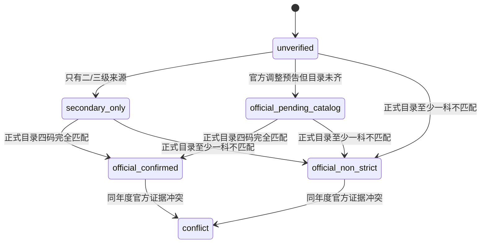

# 证据与严格 22408 状态规则

## 为什么拆成两个字段

旧 CSV 的 `is_strict_22408` 同时混入 yes/no、证据等级和说明，而且没有四科代码。系统因此保存：

1. `strict_22408_claim`：旧资料声称什么；
2. `strict_22408_status`：当前可核验证据支持什么。

旧声明不会自动成为事实。

## 状态转换

`official_confirmed` 必须满足：同一项目、同一招生年度、正式来源明确给出 `101+204+302+408`。学校级公告、往年目录或只宣布“改408”均不够。

## 来源等级

- `official`：官方目录、正式名单、复试办法、收费公示等原始材料；
- `official_mixed`：一行同时依赖官方与二级整理；
- `secondary`：机构或社区整理；
- `tertiary`：经验帖，仅可描述流程和体验；
- `unknown`：无法独立识别。

来源等级高也不会自动解决口径冲突。必须先核对年份、学院、方向、培养地点、考生群体和分数线层级。

来源等级只回答“底稿来自哪里”，不回答“数字是不是文件直接写出”，也不回答名单中空白备注代表哪种未公开分类。如果一个数由多份官方名单、硬性规则和招生计划共同复现，来源等级仍可为 `official`，但 `population_scope`、`statistic_scope` 和注释必须明确写成“官方制度推导，非最终名单直证”。南昌大学校级最终名单原始 PDF 可逐行直证数学与计算机学院 085405 的“全日制且备注空白”25 行、软件学院同口径 37 行；它不能单独证明空白备注必然等于普通统考。数据库保留旧推导及原先误挂普通统考键的名单主张，追加 `unresolved` 裁决，并以专用事实键保存准确筛选口径。

默认项目查询采用 `evidence_resolved` 投影：未核实的导入数值、校区、来源等级和来源摘要不会因为同一行四科已经确认就一起显得“官方”。原始快照只在显式 `--raw-imported` 时返回。四科、数值和培养地点分别由独立证据域决定，任何一个域的确认都不能向其他字段扩散。

## 保守解析

- `115(另一名单口径107)`：保留原文，结构化人数为 NULL并生成问题；
- `129(含专项32)`：不提取129作为普通统考人数；
- `75000/全程`：不冒充每年学费；
- `339/281`：不压成一个复试线；
- A5第38—41行：仅根据正文可证实的固定映射修复影子值，原始行不改。

## 字段冲突与裁决

`fact-add` 接受原子整数、小数、布尔或文本值，并强制显式填写 `population_scope` 与 `statistic_scope`。每条主张绑定来源、证据等级、群体口径和 TraceId；无专项列的限定名单事实会拒绝伪装成 `ordinary_general_exam`。`quota.plan_minus_received_recommendation` 还必须提交可机读的减法操作符、`quota.total_plan` 与 `quota.recommendation_received` 两个事实键及整数操作数，数据库会复核结果；其他事实键禁止携带推导元数据。不同值会进入 `v_fact_conflicts`；`fact-resolve` 追加选择理由。旧主张与旧裁决都不覆盖。`quota.recommendation_actual` 只表示最终推免拟录取公示名单的项目级行数，不表示最终报到入学人数。

迁移 029 的普通事实触发器把“来源是官方”与“群体口径是普通统考”分开：
`official_mixed` 不能再写入普通统考机器字段。历史上已经写入的错误裁决不删除，
而是追加 `unresolved`；只有重新取得同一项目、同一年度、专项拆分完整的正式证据后，
才能追加新的 `official` 主张和接受裁决。
